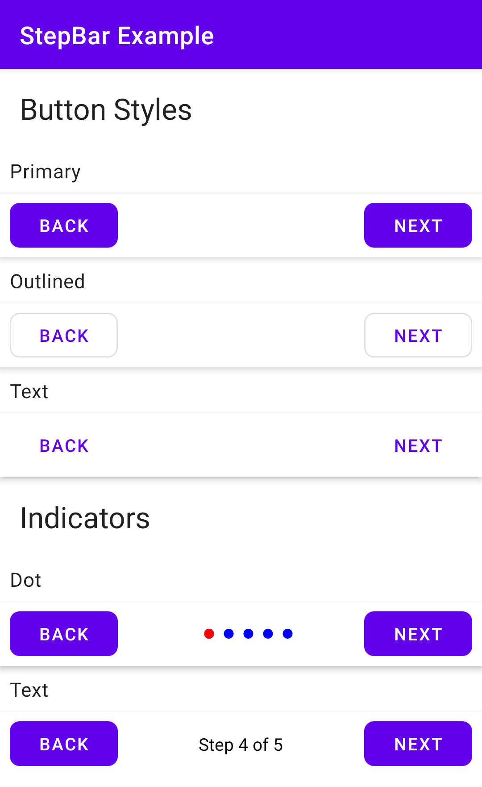

[  ](https://bintray.com/luscii/maven/stepbar/_latestVersion)

# Step Bar Module
A material design step bar module with multiple indicator styles.

[  ]

## View Properties
| Attribute | Type | Code | Description |
|---|---|---|---|
| stepCount | Integer | stepCount | Set total step count |
| indicatorType | Enum | - | Set indicator type from `dot` or `text` |
| - | Boolean | indicatorVisibility | Set indicator visibility |
| leftButtonText | String | setLeftButtonText |  Set left button text |
| leftButtonIcon | Drawable | - | Set left button icon |
| leftButtonType | Enum | - | Set left button type from `primary`, `text` or `outlined` |
| leftButtonEnabled | Boolean | leftButtonEnabled | Set or check left button enabled or disabled |
| - | Boolean | leftButtonVisible | Set or check left button visibility |
| - | View.OnClickListener | leftButtonClickListener | Set left button click listener |
| rightButtonText | String | setRightButtonText |  Set right button text |
| rightButtonIcon | Drawable | - | Set right button icon |
| rightButtonType | Enum | - | Set right button type from `primary`, `text` or `outlined` |
| rightButtonEnabled | Boolean | rightButtonEnabled | Set or check right button enabled or disabled |
| - | Boolean | rightButtonVisible | Set or check right button visibility |
| - | View.OnClickListener | rightButtonClickListener | Set right button click listener |
| autoHideButtons | Boolean | autoHideButtons | If set the left button will be hidden on first step and the right button will be hidden on last step |

## Listener
You can observe step changes using the `setListener` method.
```
stepBar.setListener(object : StepBarListener {
    override fun onStepChanged(step: Int) {

    }
})
```
